# 🚀 Modern C++ Conan Template

A modern, feature-rich C++ project template using **Conan 2.0**, **CMake**, and **C++20** best practices. This template provides a solid foundation for C++ projects with dependency management, cross-platform support, and modern development workflows.

## ✨ Features

- **Modern C++20** with enhanced language features
- **Conan 2.0** for robust dependency management
- **Cross-platform support** (Windows, Linux, macOS)
- **Modern CMake** with best practices and presets
- **Enhanced logging** with spdlog
- **Colorful terminal output** with fmt formatting
- **Robust error handling** and user interaction
- **Clean project structure** for easy extension
- **Simple workflow**: `./configure && ./make && ./run`

## 🏗️ Project Structure

```
cpp-conan-template/
├── conanfile.py              # Modern Conan 2.0 recipe
├── CMakeLists.txt           # Modern CMake configuration
├── README.md                # This file
├── scripts/
│   ├── constants.sh         # Enhanced utilities and constants
│   ├── configure_cmake.sh   # Legacy CMake setup (Windows)
│   └── configure_gcc.sh     # Legacy GCC setup (Windows)
├── src/
│   ├── main.cpp            # Modern main application
│   ├── app.cpp             # Application logic
│   └── app.hpp             # Application header
├── configure               # Modern configuration script
├── make                   # Modern build script
└── run                    # Auto-generated run script
```

## 📋 Prerequisites

- **Python 3.7+** with pip
- **Git** for version control
- **C++ Compiler** (GCC 11+, Clang 13+, or MSVC 2019+)
- **CMake 3.21+** (will be set up automatically on Windows)

### Quick Setup

```bash
# Install Conan (if not already installed)
pip install conan>=2.0

# Clone the template
git clone https://github.com/yourusername/cpp-conan-template.git
cd cpp-conan-template
```

## 🚀 Getting Started

The template maintains the familiar three-step workflow while using modern tools under the hood:

```bash
# 1. Configure dependencies and tools
./configure

# 2. Build the project
./make

# 3. Run the application
./run
```

### Visual Workflow

```mermaid
flowchart TD
    A[Start] --> B[./configure]
    B --> C{Dependencies OK?}
    C -->|Yes| D[./make]
    C -->|No| E[Install missing tools]
    E --> B
    D --> F{Build OK?}
    F -->|Yes| G[./run]
    F -->|No| H[Check errors]
    H --> D
    G --> I[🎉 Success!]
    
    subgraph "What ./configure does"
        J[Check Python/pip]
        K[Install/verify Conan 2.0]
        L[Setup profiles]
        M[Download tools if needed]
    end
    
    subgraph "What ./make does"
        N[Install dependencies]
        O[Configure CMake]
        P[Build with modern C++]
        Q[Create run script]
    end
```



## 🔧 Configuration Options

### Environment Variables

You can customize the build process with environment variables:

```bash
# Build type (Debug, Release, RelWithDebInfo, MinSizeRel)
export BUILD_TYPE=Debug

# Conan profile to use
export CONAN_PROFILE=default

# Number of parallel build jobs
export JOBS=8

# Enable debug output
export DEBUG=1

# Example: Debug build with verbose output
BUILD_TYPE=Debug DEBUG=1 ./make
```

### Build Types

- **Release** (default): Optimized for performance
- **Debug**: With debug symbols and logging
- **RelWithDebInfo**: Optimized with debug info
- **MinSizeRel**: Optimized for size

## 📦 Dependencies

The template includes these modern C++ libraries:

- **[fmt](https://github.com/fmtlib/fmt)**: Modern string formatting
- **[spdlog](https://github.com/gabime/spdlog)**: Fast logging library
- **[Catch2](https://github.com/catchorg/Catch2)**: Testing framework (Debug builds)

### Adding Dependencies

Edit `conanfile.py` and add your requirements:

```python
def requirements(self):
    self.requires("fmt/11.0.2")
    self.requires("spdlog/1.12.0")
    self.requires("boost/1.83.0")        # Add new dependency
    self.requires("nlohmann_json/3.11.2") # Another example
```

Then rebuild:

```bash
./make clean
./make
```

## 🛠️ Development

### Project Structure Guidelines

- **src/**: Source implementation files (.cpp)
- **include/**: Public header files (.hpp)
- **tests/**: Unit tests and test utilities
- **scripts/**: Build and utility scripts
- **docs/**: Documentation files

### Code Style

The template enforces modern C++ practices:

- **C++20 standard** with latest features
- **RAII** and smart pointers
- **const correctness** and move semantics
- **Comprehensive error handling**
- **Modern CMake** target-based approach

### Adding New Source Files

1. Add `.cpp` files to `src/`
2. Add headers to `src/` (private) or `include/` (public)
3. Update `CMakeLists.txt`:

```cmake
target_sources(${PROJECT_NAME} PRIVATE
    src/main.cpp
    src/app.cpp
    src/new_module.cpp  # Add your new file
)
```

## 🧹 Cleaning Up

Remove all generated files and dependencies:

```bash
# Clean build artifacts only
./make clean

# Clean everything (dependencies, tools, cache)
./configure clean
```

## 🔍 Troubleshooting

### Common Issues

**Conan not found:**
```bash
pip install conan>=2.0
# or
pip3 install conan>=2.0
```

**Wrong Conan version:**
```bash
pip install --upgrade conan>=2.0
```

**Build fails:**
```bash
# Clean and retry
./make clean
./make

# Enable debug output
DEBUG=1 ./make
```

**Dependencies not found:**
```bash
# Force rebuild dependencies
./configure clean
./configure
./make
```

### Platform-Specific Notes

**Windows (Git Bash/WSL):**
- Uses MinGW-w64 GCC 14.1 (auto-downloaded)
- CMake 3.29+ (auto-downloaded)
- Ninja build system

**Linux/macOS:**
- Uses system compiler and tools
- Install CMake via package manager if needed
- Conan will detect and configure automatically

## 🤝 Contributing

1. Fork the repository
2. Create your feature branch: `git checkout -b feature/amazing-feature`
3. Commit your changes: `git commit -m 'Add amazing feature'`
4. Push to the branch: `git push origin feature/amazing-feature`
5. Open a Pull Request

## 📄 License

This project is licensed under the MIT License - see the [LICENSE](LICENSE) file for details.

## 🙏 Acknowledgments

- [Conan.io](https://conan.io/) for excellent C++ package management
- [CMake](https://cmake.org/) for cross-platform build system
- [fmt](https://fmt.dev/) for modern string formatting
- [spdlog](https://github.com/gabime/spdlog) for fast logging

---

**Happy coding!** 🎉

If you find this template useful, please ⭐ star the repository and share it with other C++ developers!